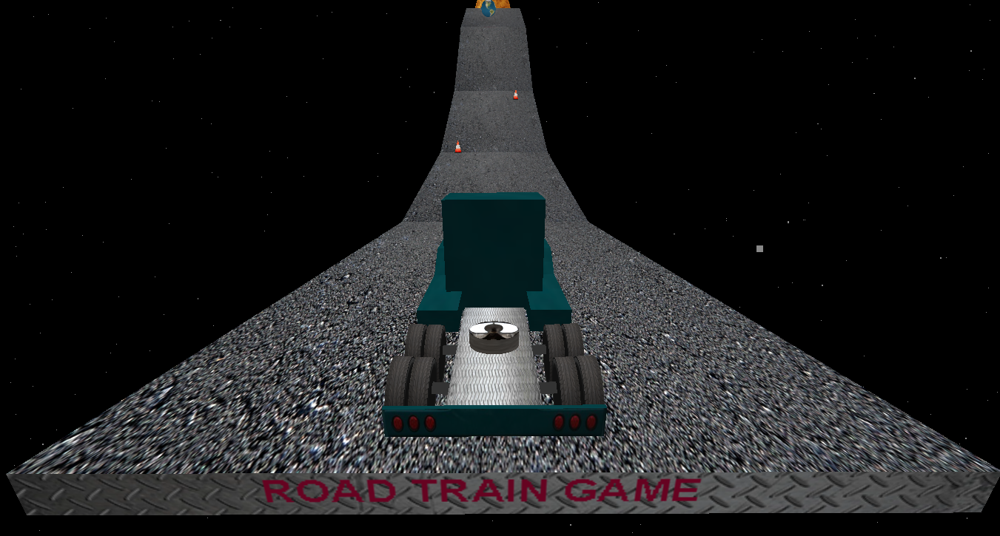

Roadtrain
===========
Roadtrain is a javascript game that I have created as a practice to learn 3D and physic libraries.

## Credits

This repo is compiled by [Makan Edrisi](https://github.com/makannew)

## Structure
I have used [Mgame](https://github.com/makannew/MGame) to build this game. 

[Mgame](https://github.com/makannew/MGame) implement [Three.js](https://github.com/mrdoob/three.js) as 3D liberary and [Cannon.js](https://github.com/schteppe/cannon.js) as physic liberary to provide an easy way to develop javascript games.

## What I have learned
Combining 3D and physic libraries result to a realistic feeling in a game. However, there is computation limitation which cause frame rate drops below 60fps which is not desired.
During debuging I have noticed the bottleneck of performance is in physic engine, mainly in collision detection function.
Collision detector is responsible to find out where two objects touching by applying math operations between each object with all others. In other word performance exponentialy decrease by increasing total objects.
This has a huge effect in physic game development in javascipt by limiting to only simple games.

Although, I think there are some way to fix this problem which i mention below:
- using web workers to take advantage of multi-thread computing
- using web-assembly
- using machin-learning model as collision detection function

